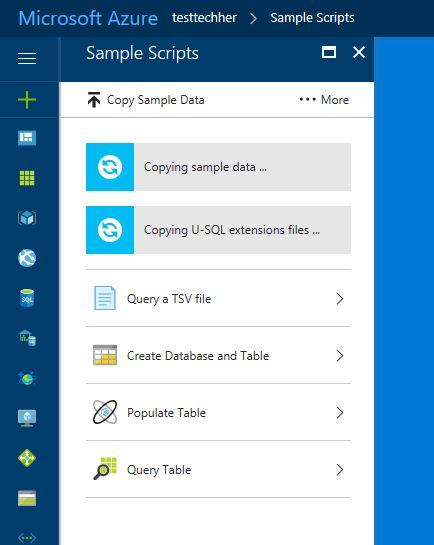
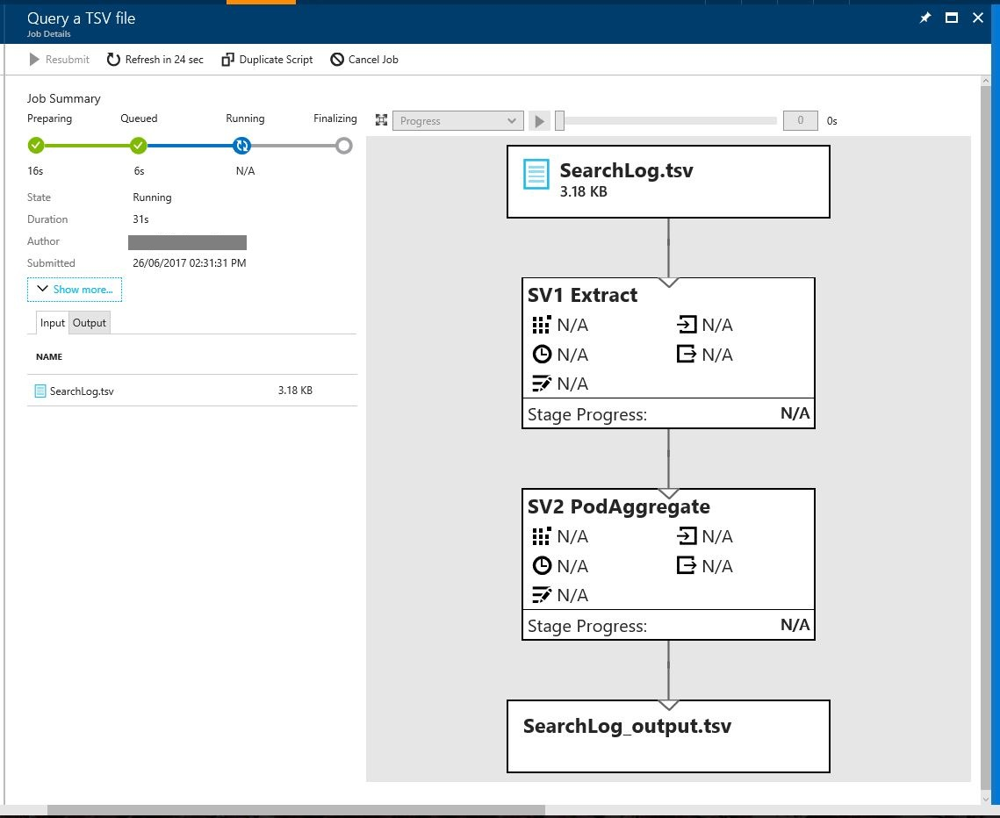
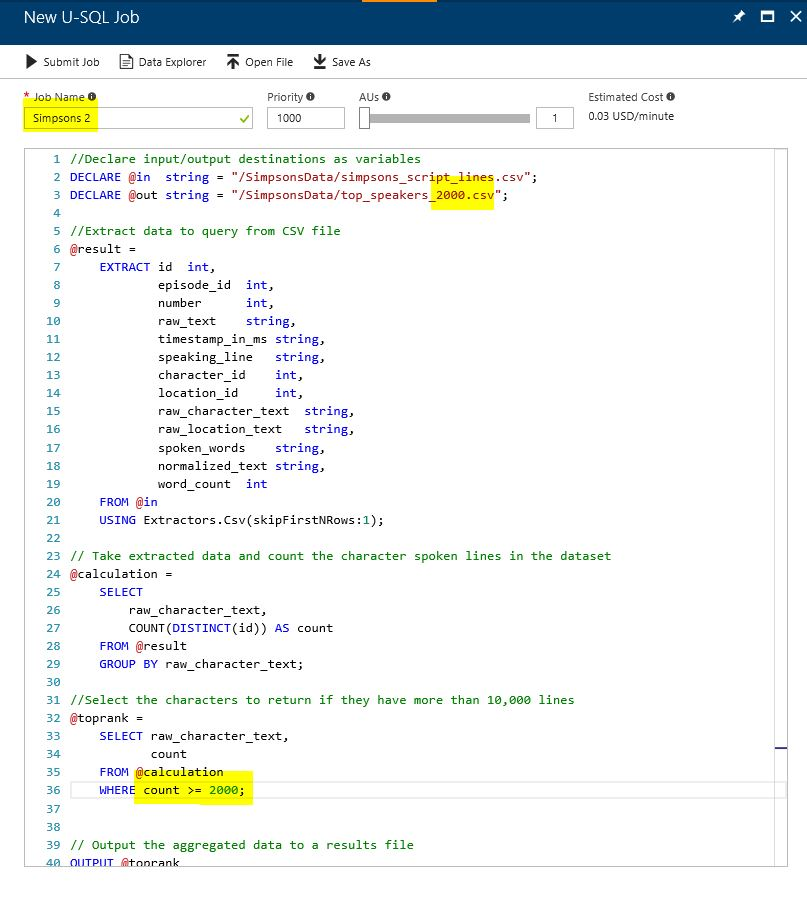

# TechHer: Let your Data tell you the Real Story: Advanced Analytics on Azure

During this hands on lab at TechHer UK June 2017 we will be using the **Azure Data Lake Analytics** and **Azure Machine Learning** services with some sample datasets.

### Pre-requistes:
* [An Azure Subscription](https://azure.microsoft.com/en-gb/free/)
* [Azure Storage Explorer](http://storageexplorer.com/)
* [ADLcopy tool](https://www.microsoft.com/en-us/download/details.aspx?id=50358)

Please download the Azure Storage Explorer and ADLCopy tools from the links above

## Azure Data Lake Analytics

### Exercise 1: Sample Scripts

Lets get started by creating an Azure Data Lake Analytics account

1. **Create an account**
    1. Sign in to the Azure portal.
    2. Click **New > Data + analytics > Data Lake Analytics**.
    3. Select values for the following items: 
        1. **Name:** The name of the Data Lake Analytics account. *[Techher_initials]*
        2. **Subscription:** The Azure subscription used for the account.
        3. **Resource Group:** The Azure resource group in which to create the account. *[Techher_initials]*
        4. **Location:** The Azure datacenter for the Data Lake Analytics account. *[North Europe]* 
        5. **Data Lake Store:** The default store to be used for the Data Lake Analytics account. The Data Lake Store account and the Data Lake Analytics account must be in the same location. *[Create new data lake store]*
        6. **Pricing Tier:** Set as Pay-as-you-go
    4. Select Pin to Dashboard
    5. Click Create. 


Once created you will see the screen below load. Have a look around and then click on **'Sample Scripts'** to walk you through some query and process examples for Azure Data Lake Analytics in the Azure Portal.

  

Once loaded click 'Sample Data Missing' and 'U-SQL Advanced Analytics Extensions' to download the data and extensions needed to run the sample.


This download will take a couple of minutes




Once completed and you see the green icons above, now choose **'Query a TSV file'** and read through the U-SQL job.


Lets take a look at the datasets being used that are stored in your Azure Data Lake Store account. To do this select 'Data Explorer' at the top of the screen.

Your Azure Data Lake Store will load. Given the input schema given in the query - find the file and view the data

``` FROM @"/Samples/Data/SearchLog.tsv" ```


Once you have viewed the data, close the storage windows by clicking the 'X' in the top right of each blade until you only have the 'New U-SQL Job' blade

Now choose submit job using 'Submit Job' button at the top of the blade.

Once submitted you will see a blade with the job details and the progress of the job.


Once the job is running the blade will also produce a job graph - showing the breakdown of the query (input files, output files, extract and aggregate processes)



Once the job summary shows the process as complete, the job graph is green and explains how much data (in rows) was written to the output file. Now click the tab 'Output' and select the SearchLog_output.tsv file to review the output data


in this file you will see the whole contents of the input file was written to the output file. This query shows the input and output syntax of a simple U-SQL query. 

Now close all blades and go back to the sample scripts blade


There are 3 more queries to explore:
1. Create Database and Table
2. Populate Table
3. Query Table

Go ahead and run/explore the queries that show you how to create database tables in u-sql in your data lake store, populate the .TSV file data into the database table and query that table to show data in there.

Feel free to [tweak queries and explore the U-SQL language further](https://docs.microsoft.com/en-us/azure/data-lake-analytics/data-lake-analytics-u-sql-get-started).


### Exercise 2: Simpsons Data

**Dataset used: datasets/simpsons_text_analysis.csv**

For the next exercise we are going to use an open data set available here:
to work with data relating to the Simpsons Script Lines - data is available in this github repo [datasets/simpsons_script_lines.csv](datasets/simpsons_script_lines.csv)

download this github repo by choosing **'Clone or download' -> 'Download ZIP'**. This should not take long to download.

 

 Once downloaded, save in an accessible place on your device and then extract the files from the .zip folder. In the datasets folder you should see the file *simpsons_script_lines.csv*

 Now go to the azure portal main page (click the top left corner 'Microsoft Azure' image). Type into the search bar next to the notifications symbol the name of your data lake store account

 

 Once your Data Lake Store is open, explore the data contained using the **'Data Explorer'**


Create a new folder in your store called **'SimpsonsData'**


Open the SimpsonsData folder and upload the local *simpsons_script_lines.csv* file


Once the upload is complete (this will take a couple of minutes) click on the file and view the contents of the dataset.


Now go back to the main page of the portal (select Microsoft Azure logo in top left corner of the screen) and find and open your Azure Data Lake Analytics instance

Once open, select **'New Job'**

Edit the Job Name to **'Simpsons 1'**

and copy the code below *(or get code from the adla_scripts folder: simpsons_query_10000_speaking_lines.txt)*

```
//Declare input/output destinations as variables
DECLARE @in  string = "/SimpsonsData/simpsons_script_lines.csv";
DECLARE @out string = "/SimpsonsData/top_speakers_10000.csv";
 
//Extract data to query from all CSV files in NetherTestData to compute DAU's
//Schema needed: Unqiue user ID and Event Date in ISO format
@result =
    EXTRACT id  int,
            episode_id  int,
            number      int,
            raw_text    string,
            timestamp_in_ms string,
            speaking_line   string,
            character_id    int,
            location_id     int,
            raw_character_text  string,
            raw_location_text   string,
            spoken_words    string,
            normalized_text string,
            word_count  int
    FROM @in
    USING Extractors.Csv(skipFirstNRows:1);

// Take data and count distinct user IDs. Aggregate the query by full date (per day)
@calculation =
    SELECT
        raw_character_text,
        COUNT(DISTINCT(id)) AS count
    FROM @result
    GROUP BY raw_character_text;

@toprank =
    SELECT raw_character_text,
           count
    FROM @calculation
    WHERE count >= 10000;
    

// Output the aggregated DAU results to output file specified above
OUTPUT @toprank
    TO @out
    USING Outputters.Csv();
```
and select **'Submit Job'**


Once the job is completed review the U-SQL query code and then explore the output file. You should see the characters in the Simpsons who have spoken more than 10,000 lines - **are they who you expect?**

Lets tweak this query slightly. On the job details blade choose **'Duplicate Script'**


Make edits to the new query so that:
* The job name is 'Simpsons 2'
* The output file is 'top_speakers_2000.csv'
* The WHERE count calculation is >= 2000



and submit the job. Once complete explore the output results file to see which characters speak more than 2000 lines in the dataset - **are they who you expect?**


## Azure Machine Learning

**Dataset used:**
